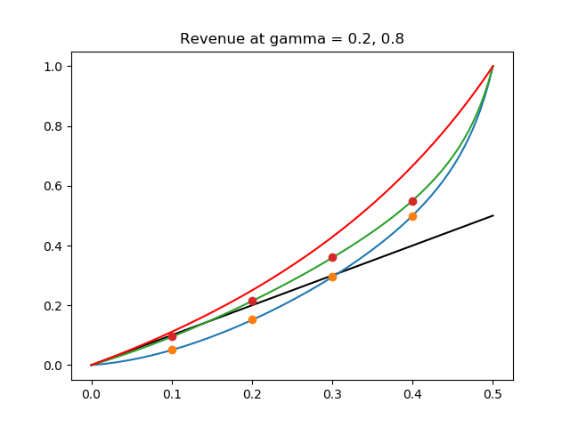

# Selfish-Mining-Simulator

## 1. Important terms in blockchain security

- Incentive compatible: the incentives that motivate the actions of individual participants are consistent with following the rules established by the group. If a blockchain system is incentive compatible, the participants could not make profit by deviating from the protocol.
- Block race: 
- Profit threshold: minimal 𝛼 for which employing dishonest mining strategies becomes profitable.
- Block propagation:
- Block withholding: 

## 2. Markov Chain Model

*Reference: Majority is not Enough* 

In this paper, the authors came up with the "selfish mining" attack, which showed that the bitcoin system is not incentive compatible.

### 2.1 Selfish Mining Model 1

### 2.2 Simulation

Comparing the result of simulation and theoritical result of simulation using 

Simulation Result:

In this figure, the black line is the return if mining honestly, while the red line is an upper bound for selfish mining (see 3.1). The blue and green line indicates the theoritical revenue of selfish mining model 1, with gamma = 0.2, 0.8. The dots show the simulated average revenue.

## 3. Markov Decision Process Model

*Reference: Optimal Selfish Mining Strategies in Bitcoin* 

### 3.1 A simple Upper Bound for Profit of Selfish Mining 

Consider an extreme case: If every block mined by the selfish miner could override one block of honest miner, the revenue of selfish miner would be: $\frac{\alpha}{1-\alpha}$.
As a result, this is a simple upper bound for profit of selfish mining.

### 3.2 Construct the MDP Model for Selfish Mining

